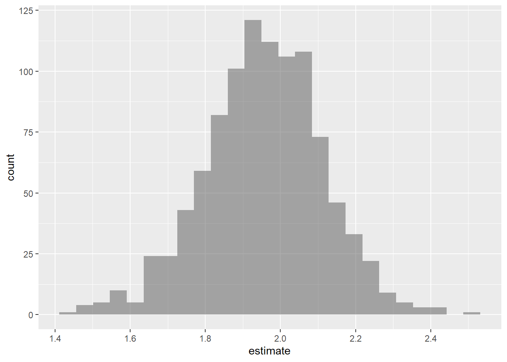

::: callout-important
- On the exam, you will not be tested on your ability to use Quarto. You will do most of your coding using an R Script (think of it as one big chunk). You can open one of these by clicking File \> New File \> R Script. You can then run your code there. The data set `tips.csv` can be found in Canvas [here](https://cofi.instructure.com/courses/17093/assignments/204171).

- While I will want you to understand simulation-based inference, I will not ask you to code up any simulation-based inference on the exam

- This practice is meant to be as exhaustive as possible so it is longer than the exam will be
:::

## Restaurant tips

What factors are associated with the amount customers tip at a restaurant? To answer this question, we will use data collected in 2011 by a student at St. Olaf who worked at a local restaurant.[^1]

[^1]: Dahlquist, Samantha, and Jin Dong. 2011. "The Effects of Credit Cards on Tipping." Project for Statistics 212-Statistics for the Sciences, St. Olaf College.

The variables we'll focus on for this analysis are

-   `Tip`: amount of the tip
-   `Meal`: which meal this was (`Lunch`, `Late Lunch`, `Dinner`)
-   `Party`: number of people in the party

## Exercise 1

Load the following packages `tidyverse`, `broom`, `ggformula`, `yardstick` and `mosaic`.

## Exercise 2

Load and look at the `tips.csv` data set.

## Exercise 3

Generate appropriate plots AND numerical summaries for the following variables:

- Univariate:
    + `Tip`
    + `Party`
    + `Meal`
- Bivariate:
    + `Tip` vs. `Meal`
    + `Tip` vs. 

The goal is to fit a model that uses the number of diners in the party to understand variability in the tips. For Exercise 4-8, assume we are only using `Party` and **not** `Meal` to predict `Tip`.

## Exercise 4

Write the statistical model that we will be trying to estimate. Use Greek letters and include an error term. (This will be completed on a white board on the exam).

## Exercise 5

Fit the regression model corresponding to the statistical model in the previous exercise. Use `tidy` to get a 99% confidence interval for the slope.

1.  Write the regression equation and interpret the slope and intercept in the context of the data.
2.  Write down and interpret the confidence interval for the slope from above.

## Exercise 6

One family for four walks into your restaurant. On a piece of paper use your model to predict the tip. Then use R to create a confidence interval for your predictions. Did you use a "prediction interval" or not? Explain.

## Exercise 7

1.  Define $R^2$, compute the $R^2$ for your model, and interpret it in the context of the data.
2.  Define RMSE, compute the RMSE for your model, and interpret it in the context of the data.

## Exercise 8

The following code can be used to create a bootstrap distribution for the slope (and the intercept, though we'll focus primarily on the slope in our inference) for the coefficient of `Party` in our linear model. Use the plot below to (visually) construct a 90% confidence interval for the slope:

1.  Describe why you chose the values you chose for your interval.
2.  Interpret the interval in the context of the data.
3.  How would increasing the number of repetitions change the size of the confidence interval?
4.  How would increasing the sample size change the size of the confidence interval?
5.  How would increasing the confidence level change the size of the confidence interval?


::: {.cell}

```{.r .cell-code}
set.seed(1234)

boot_dist <- tips |> # <1>
  specify(Tip ~ Party) |> # <2>
  generate(reps = 1000, type = "bootstrap") |> # <3>
  fit()

boot_dist |>
  filter(term == "Party") |> 
  gf_histogram(~estimate)
```

::: {.cell-output-display}
{width=672}
:::
:::


## Exercise 9

Set-up a hypothesis test for the slope of `Party`. Make sure to include:

1.  Both hypotheses in mathematical notation and words.
2.  The test statistic.
3.  The distribution of the test statistic.
4.  The p-value.
5.  The result of your test at a significance level of $\alpha= 0.05$.

You may want to refer to the output in Exercise 5.

## Exercise 10

List the conditions necessary for conducting inference. Include how you would test each one and how you would determine if they were satisfied.

Based on the context of this problem, you should expect that the constant variance assumption is likely to be violated... why? Think about how people tip.

